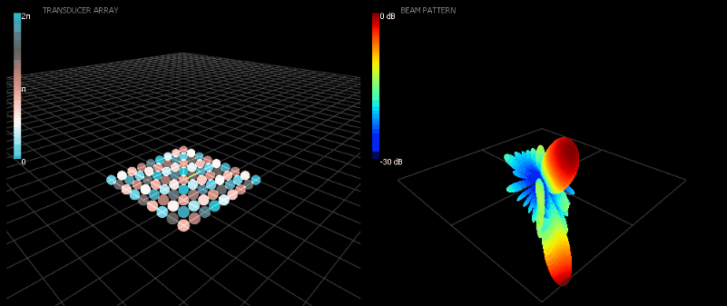

# 3d-phased-array-plotter
A 3D visualization tool for phased array analysis


## First steps

1. Install dependencies, with pip
   ```sh
   pip install -r requirements.txt
   ```
2. Clone this repo 
3. Run the script with static rendering
   ```sh
   python gui_plotter_static.py
   ```
This window should appear.


On the left side:
- the phased array elements are plotted in the volume,
- the color of each element indicates the phase shift configuration,
- the square width of the grid indicates the wavelength.

On the right side: the resulting beampattern corresponding is plotted on the whole sphere.

## Usage

**Interact** with the mouse to rotate (left button), translate (wheel button) and zoom (wheel) in both figures.

**Adjust** the array geometry, wavelength, and beam steering angles at will. `SensorArray3D.directivity_pattern_tx` takes angles from spherical coordinates (θ, φ). For azimuth and elevation, use the helper `phased_array.azel_to_thetaphi`.

**Beampattern rendering** with `PlotterArray3D.add_plot_beampattern` and `PlotterArray3D.add_plot_beampattern` remains flexible, _e.g._ to choose between linear or dB scale. Ensure that the values are scaled between 0 (min) and 1 (max).

**Animated** visualization is possible to visualize _e.g._ beam scanning:
1. Run the script example
   ```sh
   python gui_plotter_animated.py
   ```
2. Use `PlotterArray3D.add_plot_geometry` and `PlotterArray3D.add_plot_beampattern` at the first time to create the plots, then `PlotterArray3D.update_plot_geometry` and `PlotterArray3D.update_plot_beampattern` to update the values only.



## License

Distributed under the Apache-2.0 License. See `LICENSE` for more information.
